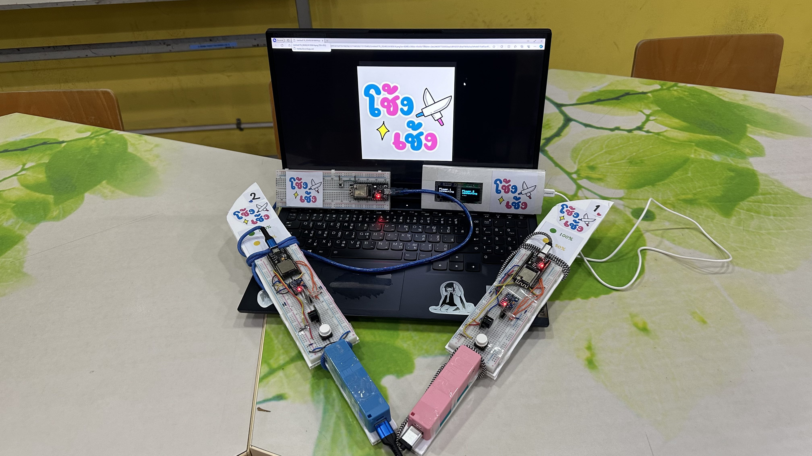
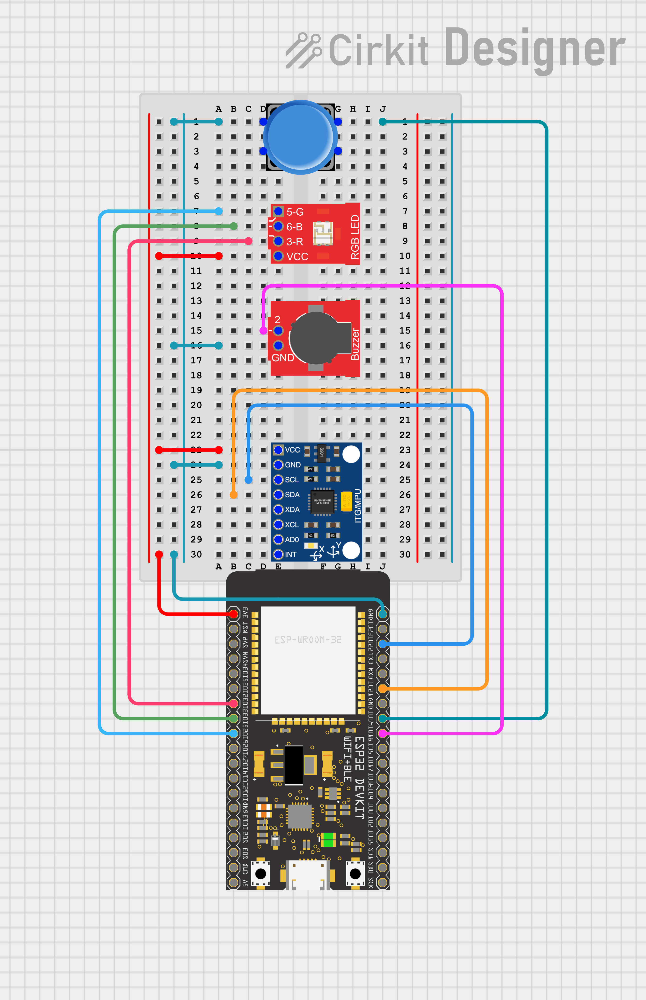
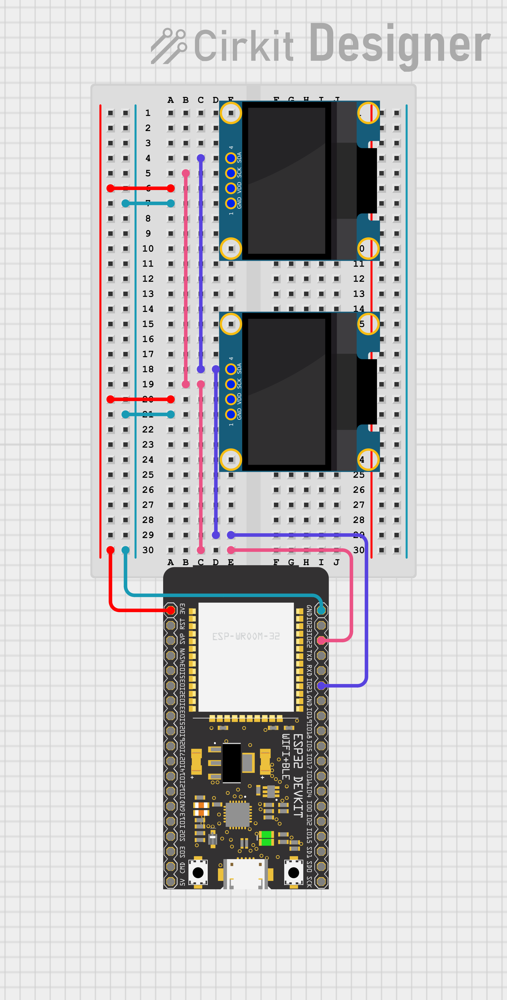
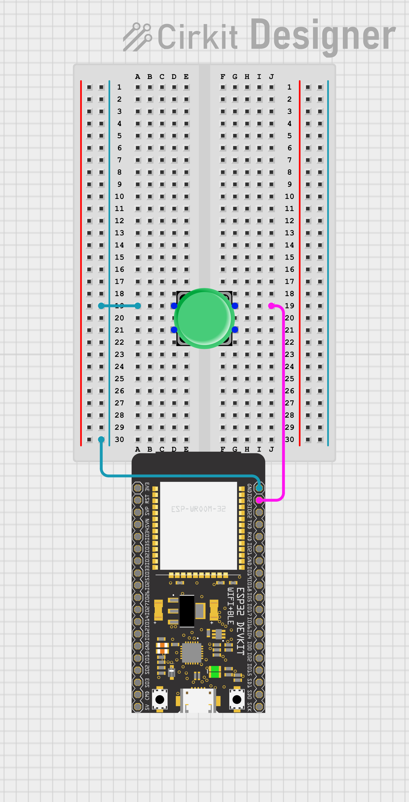

## ที่มาและความสำคัญ

โครงงานนี้มีเป้าหมายเพื่อสร้างประสบการณ์ที่แปลกใหม่ในการเล่นเกม โดยกลุ่มของเราเลือกเป็นเกมฟันดาบที่มีผู้เล่น 2 คน ผู้เล่นหมายเลข 1 (สีชมพู) และผู้เล่นหมายเลข 2 (สีฟ้า) โดยผู้เล่นสามารถกวัดเกว่งดาบในชีวิตจริงเพื่อเล่นเกมได้ สร้างประสบการณ์การเล่นเกมที่สมจริงมากขึ้น




## ฟีเจอร์ที่สำคัญ

- มีระบบเกมฟันดาบที่มีผู้เล่น 2 คน
  - สามารถเริ่มเกมได้
  - สามารถตัดสินผลแพ้ชนะเมื่อผู้เล่นคนใดคนหนึ่งเหลือ Health เป็น 0
- ตัวดาบ 2 ชิ้น
  - สามารถฟันดาบได้ในทิศทางตั้งฉากกับพื้นและ ขนานกับพื้น
  - สามารถตั้งท่าป้องกันในทิศทางตั้งฉากกับพื้นและ ขนานกับพื้น
  - มีไฟ LED บอกสถานะของ Health ของตนเอง
  - มีเสียงบอกหากฟันเข้าฝ่ายตรงข้ามหรือสามารถกันการโจมตีจากฝ่ายตรงข้ามได้
- หน้าจอแสดงผล
  - สามารถแสดงสถานะ Health ของผู้เล่นทั้งสองฝ่ายได้
  - สามารถแสดง Action ของผู้เล่นได้ เช่น Hit(ถูกโจมตี) Block(สามารถป้องกันการโจมตีได้)

## แนวคิดและหลักการ


### โมเดลข้อมูลสถานะเกม

```c
struct_game {
  uint8_t gameStage;      // 0: Waiting, 1: Playing, 2: End
  uint8_t playerNumber;   // 1: player1, 2: player2, 0: default
  uint8_t action;         // 1: block, 2: hit(lost blood), 0: default
  int player1health;
  int player2health;
}
```

### ส่วนดาบ (Sword Player 1 and Player 2)

#### อุปกรณ์ (ดาบ)



| อุปกรณ์                            | จำนวน (ต่อ 1 เล่ม) |
| ---------------------------------- | ------------------ |
| Microcontroller [NodeMCU ESP32-S]  | 1                  |
| Gyroscope & Accelerator [MPU-6050] | 1                  |
| RGB Led Module [HW-479]            | 1                  |
| Passive Buzzer Module              | 1                  |
| Button                             | 1                  |
| 18650 Lithium Battery              | 1                  |

#### หลักการ (ดาบ)

ในส่วนของดาบทำหน้าที่ในการส่ง Action ของผู้เล่นแต่ละคนไปยัง Server กลางโดยใช้ gyroscope sensor ในการรับข้อมูลทิศทางในการหันของดาบ หากต้องการฟันดาบ sensor รอรับค่าความเร่งของดาบโดยใช้ acceleration sensor เพื่อรับรู้การฟันดาบจากทิศทางของดาบที่มีความคม และหากต้องการป้องกัน ทำได้โดยการกดปุ่มที่ดาบเพื่อป้องกัน ดาบจะส่งข่อมูลทิศทางการป้องกันไปยัง server กลาง โดยทั้งการโจมตีและการป้องกัน มีการส่งข้อมูลที่มีโครงสร้างดังนี้

```c
struct_message {
  uint8_t swordNumber;  // 1: sword1, 2: sword2, 0: default
  char orientation;     // 'v': vertical, 'h': horizontal, 'n': default
  uint8_t action;       // 1: attack, 2: block, 0: default
}
```

ดาบยังรับข้อมูลลจาก Server กลาง เกี่ยวกับสถานะของเกม และ Action ของผู้เล่น โดยจะมีการตอบสนองกับ action ต่างๆดังนี้ เมื่อโจมตีคู่ต่อสู้หรือป้องกันได้สำเร็จ ดาบจะส่งสัญญาณเสียง และแสดงสี LED ตามสถานะของเลือดของผู้เล่น และเมื่อเลือดของผู้เล่นหนึ่งหมดจะส่งสัญญาณเสียงแสดงความยินดีกับผู้ชนะ

### ส่วนจอแสดงสถานะเกม (Monitors)

#### อุปกรณ์ (จอสถานะเกม)



| อุปกรณ์                           | จำนวน |
| --------------------------------- | ----- |
| Microcontroller [NodeMCU ESP32-S] | 1     |
| OLED 128x64 I2C                   | 2     |

#### หลักการ (จอสถานะเกม)

ในเกมนี้จะใช้งานจอแสดงผล OLED จำนวน 2 ชิ้น โดยที่จะเชื่อมต่ออยู่กับ Microcontroller เครื่องเดียว

จอแสดงผล OLED ทั้น 2 ชิ้นนั้นจะใช้สำหรับแสดงข้อมูลของผู้เล่นแต่ละคนแยกกัน

ข้อมูลที่แสดงบนจอหลักๆจะขึ้นอยู่กับสถานะของเกม โดยที่[ข้อมูลของสถานะเกม](#โมเดลข้อมูลสถานะเกม)จะได้รับมาจากตัวควบคุมเกม (Server)

- หากเกมอยู่ในสถานะรอเล่น (gameStage = 0)
  - ทั้ง 2 จอจะแสดงว่า `Waiting...`
- หากเกมอยู่ในสถานะกำลังเล่น
  - หากไม่ได้มีการโจมตีอยู่
    - แสดงเลือดของทั้ง 2 ผู้เล่น
  - หากฝั่งใดฝั่งหนึ่งโดนโจมตี
    - แสดง `Got Hit!` ในฝั่งที่โดนโจมตี
    - หลังจากนั้นแสดงเลือดของทั้ง 2 ผู้เล่น
  - หากฝั้งใดฝั่งหนึ่งป้องกันการโจมตีได้
    - แสดง `Block!` ในฝั่งที่ป้องกันการโจมตี
    - หลังจากนั้นแสดงเลือดของทั้ง 2 ผู้เล่น

### ส่วนควบคุมเกม (Server)

#### อุปกรณ์ (ตัวควบคุมเกม)



| อุปกรณ์                           | จำนวน |
| --------------------------------- | ----- |
| Microcontroller [NodeMCU ESP32-S] | 1     |
| Button                            | 1     |

#### หลักการ (ตัวควบคุมเกม)

Server (ตัวควบคุมเกม) ทำหน้าที่ในการเป็นตัวกลางประมวลผลข้อมูลระบบเกม โดยเก็บข้อมูลเกี่ยวกับ Player แต่ละคน (Player1/ Player2) โดยมีรูปแบบดังนี้

```c
Player1 {
  uint8_t action;     // 1: attack, 2: block, 0: default
  char direction;     // 'v': vertical, 'h': horizontal, 'n': default
  int health;
}
```

เมื่อ Server ได้รับข้อมูลจะมีการ Update ข้อมูลที่เก็บบไว้ภายใน server เช่น หากผู้เล่น 1 ฟันดาบในทาง vertical และผู้เล่น 2 ไม่ได้ป้องกันในทาง horizontal ผู้เล่น 2 จะถูกโจมตีทำให้เลือดผู้เล่น 2 ลดลง
เมื่อมีการเปลี่ยนแปลงสถานะของเกมหรือข้อมูล Server จะส่งข้อมูลไปทที่ส่วนแสดงผล และดาบของผู้เล่น โดยมีรูปแบบตาม[ข้อมูลเกม](#โมเดลข้อมูลสถานะเกม)

## อุปกรณ์ที่ใช้ทั้งหมด

<!-- - Microcontroller [NodeMCU ESP32-S]: 4 เครื่อง
- Gyroscope & Accelerator [MPU-6050]: 2 ชิ้น
- RGB Led Module [HW-479]: 2 ชิ้น
- Passive Buzzer Module: 2 ชิ้น
- Button: 3 ชิ้น
- OLED 128x64 I2C: 2 ชิ้น
- 18650 Lithium Battery: 2 ชิ้น -->

| อุปกรณ์                            | จำนวน |
| ---------------------------------- | ----- |
| Microcontroller [NodeMCU ESP32-S]  | 4     |
| Gyroscope & Accelerator [MPU-6050] | 2     |
| RGB Led Module [HW-479]            | 2     |
| Passive Buzzer Module              | 2     |
| Button                             | 3     |
| OLED 128x64 I2C                    | 2     |
| 18650 Lithium Battery              | 2     |

## เครื่องมือที่ใช้ในการพัฒนา

- Code Editor: **Visual Studio Code**
- Embedded System IDE: **PlatformIO IDE** extension ใน Visual Studio Code
- Communication: **ESPNow** สำหรับการสื่อสารระหว่าง board
- Source Control: **Github** สำหรับการควบคุมเวอร์ชันและซอร์สโค้ด
